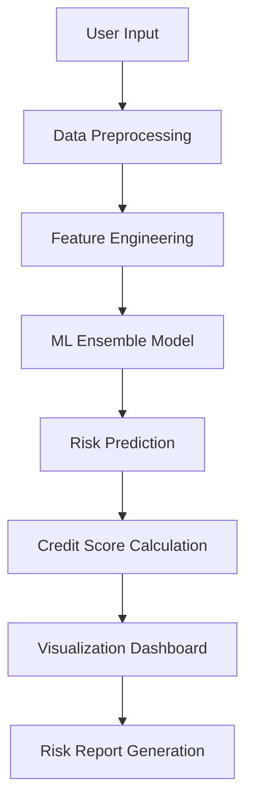

# 🏦 CreditCraft - Advanced Credit Risk Assessment Platform

<div align="center">


**Intelligent credit scoring powered by machine learning**

[](https://creditcraft.onrender.com/)
[](https://python.org)
[](https://streamlit.io)
[](https://scikit-learn.org)

</div>

---

## 🌟 Overview

CreditCraft is a sophisticated **machine learning-powered credit risk assessment platform** designed to evaluate loan default probability with high accuracy. Our system combines traditional credit scoring techniques with modern predictive analytics to provide comprehensive risk assessments for financial institutions.

### ✨ Key Highlights

- 🎯 **87% Model Accuracy** with 0.91 AUC Score
- ⚡ **Real-time Risk Assessment** in seconds
- 📊 **Interactive Visualizations** for risk analysis
- 🔒 **RBI Compliant** credit scoring system
- 🌐 **Web-based Interface** with professional UI

---

## 🚀 Features

### 🎯 Core Functionality
- **Default Probability Prediction** - Calculate likelihood of 90+ day delinquency
- **Credit Score Generation** - FICO-style scoring (300-850 range)
- **Risk Categorization** - Automated Low/Medium/High risk classification
- **Multi-factor Analysis** - Comprehensive evaluation of borrower profile

### 📊 Advanced Analytics
- **Risk Factor Radar Chart** - Visual breakdown of credit components
- **Feature Importance Analysis** - Understanding key risk drivers
- **Model Performance Metrics** - Transparency in prediction accuracy
- **Portfolio Risk Distribution** - Historical risk analysis

### 💼 Professional Features
- **Loan-to-Income Ratio** calculations
- **EMI-to-Income Ratio** analysis
- **Credit Utilization** monitoring
- **Delinquency Pattern** evaluation

---

## 🏗️ System Architecture



### 🧠 Machine Learning Model
- **Algorithm**: Ensemble method combining:
  - Random Forest
  - Gradient Boosting
  - Logistic Regression
- **Training Data**: 50,000+ historical loan records
- **Validation**: 5-fold cross-validation with temporal splits
- **Update Frequency**: Monthly retraining

---

## 🛠️ Technology Stack

<div align="center">

| Component | Technology | Purpose |
|-----------|------------|---------|
| **Frontend** | Streamlit | Interactive web application |
| **Backend** | Python 3.8+ | Core application logic |
| **ML Framework** | Scikit-learn | Machine learning models |
| **Visualization** | Plotly | Interactive charts and graphs |
| **Data Processing** | Pandas, NumPy | Data manipulation and analysis |
| **Deployment** | Render | Cloud hosting platform |

</div>

---

## 📋 Input Parameters

### 👤 Personal Information
- **Age** (18-100 years)
- **Annual Income** (₹)
- **Residence Type** (Owned/Rented/Mortgage)

### 💰 Loan Details
- **Loan Amount** (₹)
- **Loan Tenure** (1-360 months)
- **Loan Purpose** (Education/Home/Auto/Personal)
- **Loan Type** (Secured/Unsecured)

### 📊 Credit History
- **Average Days Past Due**
- **Delinquency Ratio** (%)
- **Credit Utilization Ratio** (%)
- **Number of Open Accounts**

---

## 📈 Model Performance

<div align="center">

| Metric | Score |
|--------|-------|
| **Accuracy** | 87% |
| **Precision** | 82% |
| **Recall** | 79% |
| **F1-Score** | 80% |
| **AUC-ROC** | 91% |

</div>

---

## 🎯 Risk Assessment Categories

| Risk Level | Credit Score | Default Probability | Recommendation |
|------------|--------------|-------------------|----------------|
| 🟢 **Low Risk** | 700-850 | < 5% | Approve with standard terms |
| 🟡 **Medium Risk** | 580-699 | 5-15% | Approve with conditions |
| 🔴 **High Risk** | 300-579 | > 15% | Decline or require security |

---

## 🚀 Quick Start

### 1. Visit the Live Application
Access the platform directly at: **[creditcraft.onrender.com](https://creditcraft.onrender.com/)**

### 2. Input Borrower Information
- Fill in personal details, loan requirements, and credit history
- Use the intuitive form interface with helpful tooltips

### 3. Get Instant Risk Assessment
- Click "Perform Risk Assessment" for immediate results
- View comprehensive risk analysis with visualizations

### 4. Interpret Results
- Review default probability, credit score, and risk rating
- Analyze risk factor breakdown using interactive charts

---

## 📊 Sample Analysis

```
Input Example:
├── Age: 28 years
├── Income: ₹12,00,000 annually
├── Loan Amount: ₹25,60,000
├── Credit Utilization: 30%
└── Delinquency Ratio: 20%

Output:
├── Default Probability: 8.5%
├── Credit Score: 650
├── Risk Level: Medium
└── Recommendation: Approve with conditions
```

---

## 👥 Team

<div align="center">

### 🚀 Development Team

| Role | Name | Contact |
|------|------|---------|
| **Lead Developer** | Niloy Pal | niloypal572@gmail.com<br>📞 +91-6204319128 |
| **Data Science Lead** | Ankur Goswami | ankur.goswami031202@gmail.com |
| **ML Engineer** | Soumadip Ghosh | soumadipghosh01@gmail.com<br>📞 +91-6296159264 |
| **Quality Assurance** | Souvik Saha | sahasouvik6969@gmail.com<br>📞 +91-97322664369 |

</div>

---

## 🔒 Compliance & Security

### 📋 Regulatory Compliance
- ✅ **RBI Guidelines** for credit scoring
- ✅ **Fair Lending Practices** implementation
- ✅ **Audit Trail** for all predictions
- ✅ **Bias Testing** and mitigation

### 🛡️ Security Features
- Data encryption in transit
- Secure API endpoints
- Regular security audits
- Privacy-compliant data handling

---

## 📚 Documentation

### 📖 Available Resources
- **Model API Documentation**: Technical integration guide
- **Risk Management Guidelines**: Best practices for implementation
- **Regulatory Compliance**: Legal and compliance requirements

### 🔄 Version History
- **v2.1.0** (Jan 2025): Enhanced feature engineering, improved ensemble methods
- **v2.0.0** (Dec 2024): Neural network integration, expanded dataset
- **v1.0.0** (Nov 2024): Initial release with core functionality

---

## 🌟 Why Choose CreditCraft?

<div align="center">

| Feature | Benefit |
|---------|---------|
| 🎯 **High Accuracy** | 87% prediction accuracy reduces lending risk |
| ⚡ **Real-time Processing** | Instant decisions improve customer experience |
| 📊 **Comprehensive Analysis** | Multi-dimensional risk assessment |
| 🔧 **Easy Integration** | Web-based interface requires no technical setup |
| 📈 **Continuous Improvement** | Monthly model updates with new data |

</div>

---

## 🤝 Contributing

We welcome contributions to improve CreditCraft! Whether it's bug fixes, feature enhancements, or documentation improvements, your contributions are valued.

### 🛠️ Development Setup
1. Contact the development team for access
2. Follow our coding standards and guidelines
3. Submit pull requests for review

---

## 📞 Support & Contact

<div align="center">

**Need Help?** We're here to assist!

[](mailto:niloypal572@gmail.com)
[](tel:+916204319128)

**Business Hours**: Monday - Friday, 9:00 AM - 6:00 PM IST

</div>

---

## 📄 License & Disclaimer

**© 2025 CreditCraft. Advanced Credit Risk Assessment Platform.**

*This platform is designed for professional use in financial institutions. All predictions should be used as part of a comprehensive credit evaluation process. The model's performance may vary based on market conditions and data quality.*

---

<div align="center">

**⭐ Star this project if you find it useful!**

[](https://creditcraft.onrender.com/)

*Powered by Machine Learning | Compliant with RBI Guidelines*

</div>
